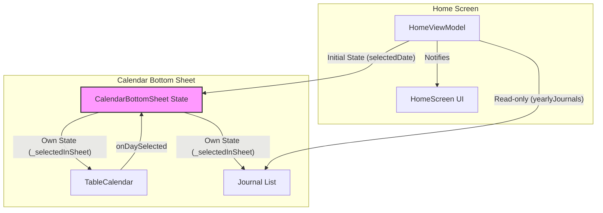

# 수정 설계 (v2): 캘린더 바텀시트에 일기 목록 추가 및 상태 분리

## 1. 개요

이 문서는 이전 설계("확장된 캘린더를 바텀시트로 이동")에 새로운 기능을 추가하고 상태 관리 모델을 변경하는 수정 설계를 설명합니다. 사용자가 바텀시트 내 캘린더에서 특정 날짜를 선택하면, 해당 날짜의 일기 목록이 바텀시트 하단에 표시됩니다. 이 모든 상호작용은 홈 화면의 상태와 완전히 독립적으로 이루어집니다.

## 2. 목표 분석

1.  **독립적인 일기 탐색**: 사용자가 홈 화면의 현재 선택된 날짜를 유지한 채로, 바텀시트를 통해 다른 날짜의 일기들을 자유롭게 탐색할 수 있도록 합니다.
2.  **컨텍스트 유지**: 바텀시트 내에서의 모든 행동(날짜 변경, 일기 조회)이 홈 화면에 영향을 주지 않도록 하여, 사용자가 탐색 후에도 원래의 컨텍스트를 잃지 않도록 합니다.
3.  **UI/UX 개선**: 캘린더와 일기 목록을 한 화면에 표시하여, 특정 날짜에 어떤 일기를 썼는지 즉시 확인할 수 있도록 사용자 경험을 개선합니다.

## 3. 고려된 대안

### 대안 1: 바텀시트 닫힐 때 날짜 동기화

바텀시트가 닫히는 시점에, 바텀시트에서 마지막으로 선택된 날짜를 홈 화면의 `selectedDate`에 반영하는 방법입니다.

*   **장점**: 사용자가 바텀시트에서 원하는 날짜를 찾고, 그 날짜의 일기 목록을 홈 화면에서 바로 이어 볼 수 있는 편리함을 제공할 수 있습니다.
*   **단점**: 사용자가 단지 다른 날짜의 일기를 확인만 하려 했을 뿐인데, 의도치 않게 홈 화면의 날짜가 변경되는 경험을 할 수 있습니다. 이는 "홈 화면 상태에 아무 영향 없었으면 좋겠다"는 사용자의 명확한 요구사항과 일치하지 않습니다.

따라서 상태를 완전히 분리하는 현재 설계가 사용자의 요구사항에 더 부합합니다.

## 4. 상세 설계

### 1단계: `CalendarBottomSheet`를 `StatefulWidget`으로 전환

상태 분리를 위해 `CalendarBottomSheet`를 `StatelessWidget`에서 `StatefulWidget`으로 변경합니다.

*   `_CalendarBottomSheetState`는 `_selectedInSheet`라는 `DateTime` 타입의 내부 상태 변수를 가집니다.
*   `initState`에서 `_selectedInSheet`는 `context.read<HomeViewModel>().selectedDate` 값으로 초기화됩니다. 즉, 바텀시트는 처음 열릴 때 홈 화면의 날짜를 기본으로 표시합니다.
*   `TableCalendar`의 `onDaySelected` 콜백은 `HomeViewModel`의 메서드를 호출하는 대신, `setState(() { _selectedInSheet = selectedDay; })`를 호출하여 `_CalendarBottomSheetState`의 내부 상태만 갱신합니다.

### 2단계: 바텀시트 UI 레이아웃 변경

`CalendarBottomSheet`의 `build` 메서드 내 레이아웃을 수정하여 일기 목록을 포함시킵니다.

*   `Column` 위젯을 `Expanded`와 함께 사용하여 `TableCalendar`와 하단의 일기 목록 영역으로 나눕니다.
*   하단 영역에는 `_buildJournalList`와 같은 별도의 메서드나 위젯을 통해, `_selectedInSheet` 날짜에 해당하는 일기 목록을 표시합니다.
*   일기가 없을 경우, "작성된 일기가 없습니다."와 같은 메시지를 표시합니다.

### 3단계: `TinyJournalCard` 위젯 (또는 `JournalCard` 수정)

홈 화면의 `JournalCard`를 재사용하되, 작은 버전을 만듭니다.

*   **방법 A (권장):** `JournalCard` 위젯을 수정하여 `bool isCompact = false`와 같은 파라미터를 추가합니다.
    *   `isCompact`가 `true`일 경우, 내부 `Padding`, `SizedBox` 간격, 폰트 크기, 이미지 높이 등을 줄여 전체적으로 작은 카드를 렌더링합니다.
    *   이렇게 하면 코드 중복을 피하고 디자인 일관성을 유지할 수 있습니다.
*   **방법 B:** `TinyJournalCard`라는 별도의 위젯을 만듭니다. `JournalCard`의 코드를 복사하여 전체적인 스타일 값을 줄이는 방식입니다. 유지보수 측면에서 방법 A보다 불리할 수 있습니다.

### 4단계: 데이터 흐름 설계

*   `CalendarBottomSheet`는 `HomeViewModel`의 전체 일기 목록(`yearlyJournals`)을 `context.watch`를 통해 계속 구독합니다.
*   `_selectedInSheet` 날짜가 변경될 때마다, `build` 메서드는 `yearlyJournals` 맵에서 해당 날짜의 일기 목록을 찾아 하단 리스트를 다시 그립니다.
*   이 과정에서 `HomeViewModel`의 어떤 메서드도 호출되지 않으므로, 홈 화면의 상태는 변경되지 않습니다.

### 다이어그램: 상태 관리 흐름

## 5. 설계 요약

1.  **`CalendarBottomSheet`를 `StatefulWidget`으로 변경**하여 독립적인 날짜 상태(`_selectedInSheet`)를 관리합니다.
2.  바텀시트 UI를 수정하여 **캘린더 하단에 선택된 날짜의 일기 목록을 표시**합니다.
3.  기존 **`JournalCard`를 수정하여 작은 버전(`isCompact: true`)을 만들고, 이를 일기 목록에 사용**합니다.
4.  바텀시트 내의 모든 상태 변경은 위젯 내부의 `setState`를 통해서만 이루어지며, **홈 화면의 `HomeViewModel` 상태를 절대 변경하지 않습니다.**

이 설계를 통해 사용자의 요구사항을 정확히 만족시키는, 재사용 가능하고 유지보수하기 좋은 코드를 작성할 수 있습니다.
