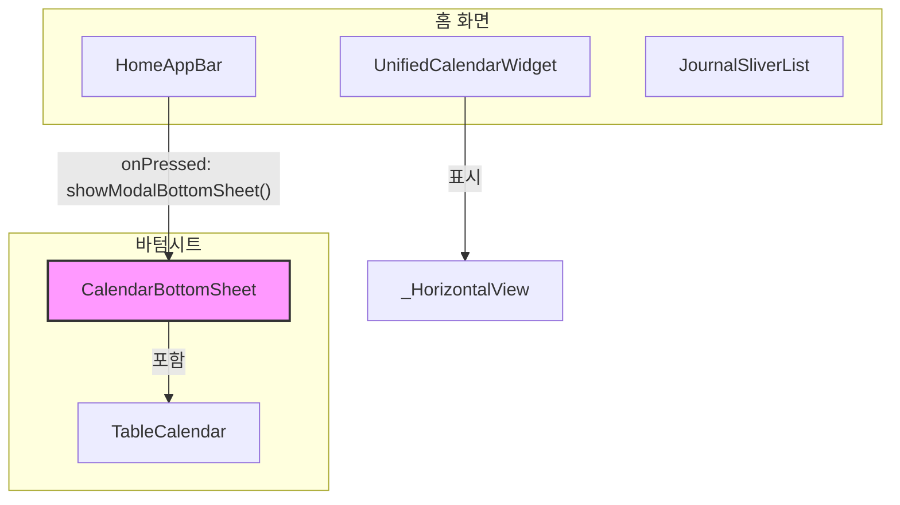

# 수정 설계: 확장된 캘린더를 바텀시트로 이동

## 1. 개요

이 문서는 MoodLog 앱의 캘린더 기능 리팩토링 설계를 설명합니다. 현재 구현은 홈 화면의 동일한 위젯 내에서 `AppBar`의 `IconButton`으로 토글되는 축소된 가로 목록(`_HorizontalView`)과 확장된 그리드 뷰(`_GridView`) 두 가지 캘린더 뷰를 표시합니다.

제안된 수정안은 확장된 그리드 뷰를 `AppBar` 버튼으로 트리거되는 모달 바텀시트로 이동하는 것입니다. 축소된 가로 캘린더는 홈 화면에 기본 뷰로 유지됩니다. 이 변경은 홈 화면 UI를 단순화하고, 확장된 캘린더를 오버레이로 만들어 사용자 경험을 개선하며, 상태 관리를 간소화하는 것을 목표로 합니다.

## 2. 문제 분석

현재 구현에는 몇 가지 단점이 있습니다.

1.  **UI 복잡성**: 메인 화면에서 두 캘린더 뷰를 토글하는 것은 번거로울 수 있습니다. `AnimatedSize` 및 `AnimatedSwitcher` 위젯은 기능적이지만 위젯 트리에 복잡성을 더하고 전환 중에 예기치 않은 UI 동작을 유발할 수 있습니다.
2.  **상태 관리**: `HomeViewModel`은 두 캘린더 뷰(`calendarViewMode`)의 상태를 모두 관리합니다. 그리드 뷰를 별도의 모달 컨텍스트로 이동하면 해당 상태를 격리하고 `HomeViewModel`을 단순화할 수 있습니다.
3.  **레이아웃 이동**: 확장된 캘린더는 홈 화면의 다른 모든 콘텐츠를 아래로 밀어내어 사용자에게 혼란을 줄 수 있는 상당한 레이아웃 이동을 유발합니다. 바텀시트는 이 상세 뷰를 표시하는 데 덜 방해가 되는 방법을 제공합니다.

목표는 캘린더 탐색을 위한 더 깨끗하고 직관적인 사용자 경험을 만드는 것입니다.

## 3. 고려된 대안

### 대안 1: 새 화면으로 이동

바텀시트 대신 `AppBar` 버튼을 사용하여 사용자를 전용 "캘린더" 화면으로 이동시킬 수 있습니다.

*   **장점**: 확장된 캘린더를 홈 화면에서 완전히 분리하여 기능에 더 많은 공간을 제공하고 상태 관리를 더욱 단순화할 수 있습니다.
*   **단점**: 이 접근 방식은 본질적으로 동일한 데이터의 다른 뷰에 비해 무겁게 느껴집니다. 전체 화면 탐색은 다른 날짜를 빠르게 선택하려는 사용자에게 너무 방해가 될 수 있습니다. 모달 바텀시트는 사용자를 홈 화면의 컨텍스트에 유지합니다.

### 대안 2: 토글 가능한 뷰를 유지하되 애니메이션 개선

현재 구조를 유지하면서 전환 애니메이션을 개선하여 더 부드럽게 만들 수 있습니다.

*   **장점**: 코드 수정이 덜 필요한 덜 침해적인 변경입니다.
*   **단점**: 홈 화면의 UI 복잡성 및 레이아웃 이동과 같은 근본적인 문제를 해결하지 못합니다.

바텀시트 접근 방식은 사용성, 컨텍스트 보존 및 코드 단순화 간의 최상의 균형을 이루기 때문에 선택되었습니다.

## 4. 상세 설계

구현은 다음 단계로 나뉩니다.

### 1단계: 새 캘린더 바텀시트 위젯 생성

`lib/presentation/screens/home/widgets/calendar_bottom_sheet.dart`라는 새 파일이 생성됩니다.

*   이 파일에는 `CalendarBottomSheet`라는 `StatelessWidget`이 포함됩니다.
*   `unified_calendar.dart`의 현재 `_GridView` 위젯 내용이 `CalendarBottomSheet`로 이동됩니다.
*   `TableCalendar` 및 관련 로직이 이 새 위젯의 핵심이 될 것입니다.
*   `_CalendarHeader`도 바텀시트 내에서 사용됩니다.

### 2단계: `HomeAppBar` 수정

`HomeAppBar`의 `IconButton`이 바텀시트를 트리거하도록 업데이트됩니다.

*   `onPressed` 콜백은 이제 `showModalBottomSheet`를 호출합니다.
*   `showModalBottomSheet` 함수는 새 `CalendarBottomSheet` 위젯을 렌더링합니다.
*   아이콘은 더 이상 두 상태 사이를 토글할 필요가 없으므로 정적 `Icons.calendar_today_outlined`로 변경됩니다.
*   `viewModel.toggleCalendarView()` 호출이 제거됩니다.

### 3단계: `UnifiedCalendarWidget` 리팩토링

이 위젯은 상당히 단순화됩니다.

*   `AnimatedSwitcher` 및 `AnimatedSize`가 제거됩니다.
*   위젯은 이제 `_HorizontalView`만 표시합니다.
*   `_GridView` 위젯이 이 파일에서 제거됩니다.
*   `calendarViewMode` 로직은 더 이상 필요하지 않으므로 `HomeViewModel` 및 관련 파일에서 제거됩니다.

### 4단계: `HomeViewModel` 업데이트

`HomeViewModel`이 정리됩니다.

*   `calendarViewMode` 속성과 `toggleCalendarView` 메서드가 제거됩니다.
*   캘린더 뷰 간 전환과 관련된 모든 로직은 더 이상 사용되지 않습니다.

### 다이어그램: 구성 요소 상호 작용

다음은 새 구성 요소 상호 작용 흐름을 보여주는 Mermaid 다이어그램입니다.

## 5. 설계 요약

1.  **`CalendarBottomSheet` 생성**: `TableCalendar`(이전 `_GridView`)를 포함할 새 위젯이 생성됩니다.
2.  **`HomeAppBar` 업데이트**: 토글 버튼이 `CalendarBottomSheet`를 여는 버튼으로 교체됩니다.
3.  **`UnifiedCalendarWidget` 단순화**: 이 위젯은 가로 캘린더 뷰만 표시하도록 리팩토링됩니다.
4.  **`HomeViewModel` 정리**: 이제 중복되는 뷰 토글을 위한 상태 및 로직이 제거됩니다.

이 설계는 두 캘린더 뷰의 관심사를 분리하여 더 깨끗한 UI, 더 직관적인 사용자 흐름 및 더 유지 관리하기 쉬운 코드베이스를 만들 것입니다.

## 6. 연구 및 참고 자료

*   **Flutter `showModalBottomSheet` 문서**: [https://api.flutter.dev/flutter/material/showModalBottomSheet.html](https://api.flutter.dev/flutter/material/showModalBottomSheet.html)
*   **Flutter `StatefulWidget` vs. `StatelessWidget`**: [https://flutter.dev/docs/development/ui/interactive#stateful-and-stateless-widgets](https://flutter.dev/docs/development/ui/interactive#stateful-and-stateless-widgets)
*   **상태 관리를 위한 Provider 패키지**: [https://pub.dev/packages/provider](https://pub.dev/packages/provider)