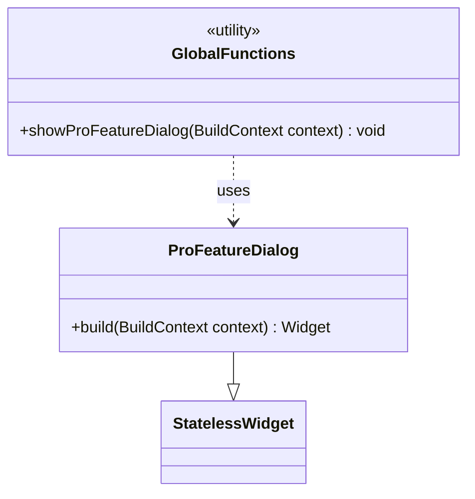
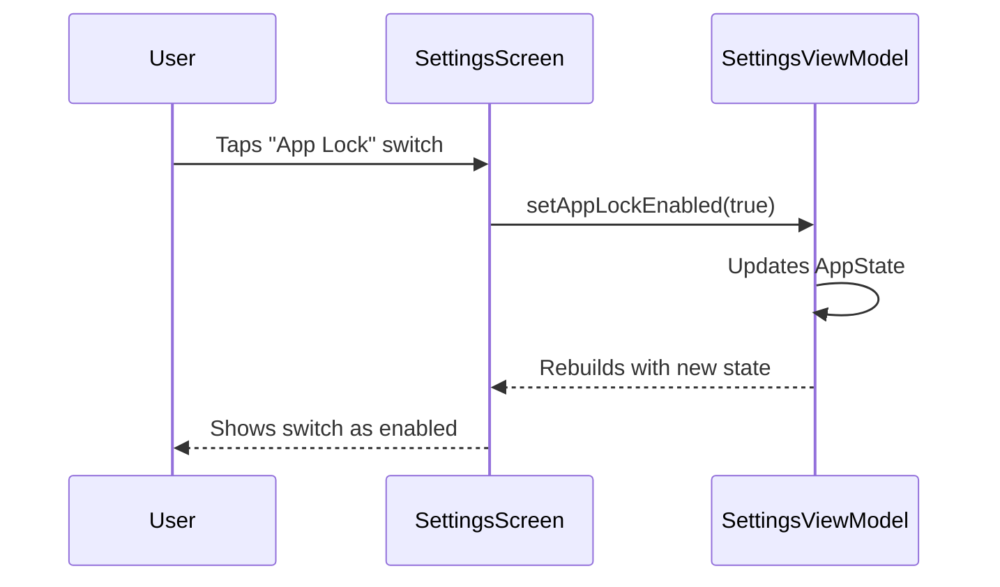

# Modification Design Document: Refactor Premium Features to Free

## 1. Overview

This document outlines the design for refactoring three existing premium features—App Lock, Cloud Backup, and Cloud Restore—into core free features. The primary goal is to increase the value of the free version of the app to attract and retain more users. The existing UI components that gate these features behind a "Pro" paywall will be removed, and the Pro feature dialog will be extracted into a reusable common widget for future use.

## 2. Detailed Analysis

### Goal

The main objective is to make the App Lock, Cloud Backup, and Cloud Restore functionalities available to all users without requiring a premium subscription. This strategic shift aims to make the app's core offering more robust and secure, which is expected to improve user satisfaction and retention.

### Problem

Currently, these three features are implemented with UI checks that verify if the user has a "Pro" subscription. If the user is not a Pro member, a dialog is displayed prompting them to upgrade. This implementation is spread across the settings screen (`settings_content.dart`) and needs to be carefully refactored.

### Key Requirements

1.  **Unlock Features:** The logic that restricts access to App Lock, Cloud Backup, and Cloud Restore must be removed.
2.  **Immediate Access:** Users should be able to activate and use these features directly from the settings screen without any upgrade prompts.
3.  **Reusable Dialog:** The "Pro Feature" dialog, which is currently defined within `settings_content.dart`, must be extracted into a separate, reusable widget. This will allow it to be easily used for other upcoming premium features.
4.  **Clean Code:** The refactoring should result in cleaner, more maintainable code by removing the now-unnecessary Pro-check logic from the settings screen.

## 3. Alternatives Considered

### Alternative 1: Conditional Compilation

Use conditional compilation (environment variables or flags) to enable/disable the premium feature checks.

-   **Pros:** Allows for easily toggling the features between free and premium during development or for different app flavors.
-   **Cons:** Adds complexity to the build process. The core requirement is to make these features permanently free, so a permanent code change is more straightforward and cleaner.

### Alternative 2: Remote Configuration (e.g., Firebase Remote Config)

Use a remote configuration service to control which features are free or premium.

-   **Pros:** Highly flexible, allowing for changes without releasing a new app version. Enables A/B testing of feature monetization.
-   **Cons:** Introduces a dependency on a network service for core feature availability, which goes against the "local-first" principle. It also adds significant implementation overhead for this specific task.

### Chosen Approach: Direct Refactoring

The chosen approach is to directly refactor the code. This is the most direct, simple, and maintainable solution that aligns with the permanent nature of the decision to make these features free.

## 4. Detailed Design

The modification will be implemented in three main steps:

### Step 1: Extract the Reusable Pro Feature Dialog

The `_showProFeatureDialog` function and its UI definition will be moved from `settings_content.dart` and `statistics_content.dart` into a new common widget.

-   **New File:** `lib/presentation/widgets/common/pro_feature_dialog.dart`
-   **Widget:** A new `StatelessWidget` named `ProFeatureDialog` will be created.
-   **Function:** A global function `showProFeatureDialog(BuildContext context)` will be defined to encapsulate the `showDialog` call, making it easy to invoke from anywhere in the app.



### Step 2: Refactor the Settings Screen (`settings_content.dart`)

The UI logic for the App Lock, Backup, and Restore tiles will be simplified.

1.  **Remove Pro-related UI:** The `GestureDetector`, `AbsorbPointer`, and `Consumer` widgets that wrap the feature tiles will be removed. The `trailing` property that displays the premium icon will also be removed.
2.  **Enable Direct Action:** The `onTap` and `onChanged` handlers will be modified to execute the feature's action directly, removing the `isProUser` check.

**Before:**
```dart
// Simplified example
Consumer<SettingsViewModel>(
  builder: (context, viewModel, child) {
    final isProUser = viewModel.appState.isProUser;
    return GestureDetector(
      onTap: () {
        if (!isProUser) {
          _showProFeatureDialog(context);
        }
      },
      child: AbsorbPointer(
        absorbing: !isProUser,
        child: SwitchTile(
          value: isProUser && viewModel.appState.isAppLockEnabled,
          onChanged: (value) {
            if (isProUser) {
              viewModel.setAppLockEnabled(value);
            }
          },
          // ... other properties
        ),
      ),
    );
  },
)
```

**After:**
```dart
// Simplified example
SwitchTile(
  value: context.select((SettingsViewModel vm) => vm.appState.isAppLockEnabled),
  onChanged: context.read<SettingsViewModel>().setAppLockEnabled,
  // ... other properties
)
```
*Note: The `Consumer` will be replaced with `context.select` and `context.read` for better performance, following the project's conventions.*

### Step 3: Update ViewModels

The `isProUser` getter in `StatisticsViewModel` and any related logic in `SettingsViewModel` are no longer needed for gating these specific features and can be removed if they are not used elsewhere. A quick search will be performed to confirm this.



## 5. Summary of Design

The design involves a straightforward refactoring of the settings screen UI to remove all premium-gating logic for the App Lock and Cloud Backup/Restore features. The core of this change is simplifying the widget structure and enabling direct access to the feature's functionality. A key part of the process is to cleanly extract the existing Pro feature dialog into a reusable common widget, ensuring it is available for future monetization efforts without cluttering the settings screen code.

## 6. Research URLs

-   **Flutter Reusable Dialog Best Practices:** [https://medium.com/@M_Y_dev/show-dialog-in-flutter-and-make-it-reusable-and-easy-to-use-e6df013771c8](https://medium.com/@M_Y_dev/show-dialog-in-flutter-and-make-it-reusable-and-easy-to-use-e6df013771c8)
-   **Flutter `context.select` vs `context.watch`:** [https://medium.com/@sardordev/improving-flutter-performance-with-context-select-in-provider-a-practical-guide-c834cab0982b](https://medium.com/@sardordev/improving-flutter-performance-with-context-select-in-provider-a-practical-guide-c834cab0982b)

*(The content of these URLs was reviewed to confirm the best practices for creating reusable widgets and using the Provider package efficiently, which directly informed the design choices.)*
